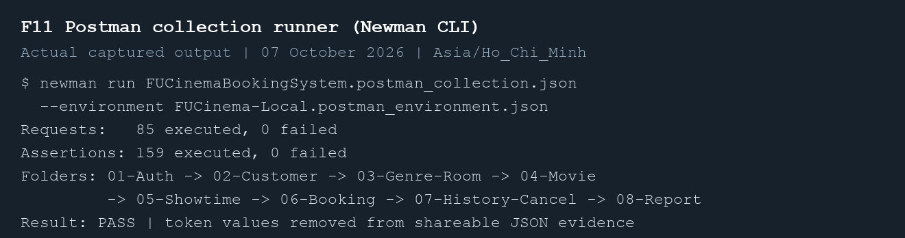

# FUCinemaBookingSystem — MSS301 Assignment 01

Java 21, Spring Boot **4.1.0**, Spring Cloud **2025.1.3**. Four independently runnable applications use SQL Server 2022, MongoDB 7.0.5, and MySQL 8.3.0. All client requests go through the Spring Cloud Gateway Server Web MVC application on port **9000**.

| Application | Port | Database |
|---|---:|---|
| customer-service | 8081 | SQL Server `cinema_customer` |
| movie-service | 8082 | MongoDB `cinema_movie` |
| booking-service | 8083 | MySQL `cinema_booking` |
| api-gateway | 9000 | JWT verification and role authorization |

## Start locally

Install JDK 21, Maven 3.9+, Docker Desktop, and Node.js/Newman for the Postman runner. SQL Server uses `linux/amd64`, allowing Docker Desktop to emulate it on Apple Silicon. Database ports are bound to localhost. The credentials in the supplied properties are the assignment's local demonstration accounts.

From this directory:

```bash
docker compose -p fu-cinema up -d
docker compose -p fu-cinema ps -a
```

Wait for `cinema-sqlserver` to be healthy and `cinema-sqlserver-init` to exit with code 0. SQL Server initialization creates `cinema_customer`; MySQL initialization creates `cinema_booking`. MongoDB creates `cinema_movie` when its seeder first writes documents. The template's reference to creating all three databases in MySQL is superseded by the assignment's database-per-service requirements.

```bash
./scripts/build.sh
./scripts/start.sh
curl http://localhost:9000/actuator/health
```

On macOS the scripts select the installed Java 21 runtime when `JAVA_HOME` is unset. On other platforms set `JAVA_HOME` to JDK 21. Logs and process IDs are in `.run/`. Use `./scripts/start.sh --foreground` in an automated terminal that cleans up background children when its command ends.

To run each service in its own terminal instead:

```bash
mvn -f customer-service/pom.xml spring-boot:run
mvn -f movie-service/pom.xml spring-boot:run
mvn -f booking-service/pom.xml spring-boot:run
mvn -f api-gateway/pom.xml spring-boot:run
```

## Test accounts

| Role | Email | Password | Notes |
|---|---|---|---|
| ADMIN | admin@fucinema.com | @@abc123@@ | Stored in customer-service properties; UID 0 |
| CUSTOMER | an@gmail.com | 123456 | UID 1, ACTIVE |
| CUSTOMER | binh@gmail.com | 123456 | UID 2, ACTIVE |
| CUSTOMER | chi@gmail.com | 123456 | UID 3, INACTIVE; login returns 403 |

Customer passwords are stored as BCrypt hashes. Customer responses omit passwords. JWT access tokens use HS256, last 60 minutes, and contain `sub`, `uid`, `role`, `iat`, and `exp`. Gateway removes every incoming `X-User-*` header and inserts the verified user context. Customer, movie, and booking applications listen locally and trust gateway headers, as specified in the assignment.

## Run Postman tests

Import these files into Postman and select **FUCinema-Local**:

- `postman/FUCinemaBookingSystem.postman_collection.json`
- `postman/FUCinema-Local.postman_environment.json`

Run folders `01-Auth` through `08-Report` in order. They cover F1–F10 and generate their own customer, genre, room, movie, and showtime variables. The test for deleting a referenced seed genre uses Sci-fi: the guide's Action seed genre has no referencing movie and would legitimately be deletable.

For the CLI runner:

```bash
npm install -g newman
./scripts/test-postman.sh
python3 scripts/verify-extras.py
```

The extra verifier temporarily stops **only this assignment's Movie Service**, checks BR14, and restores it. Under a terminal automation tool, use `python3 scripts/verify-extras.py --hold` to keep the restored process alive. It also checks expired and wrongly signed tokens, concurrent purchases, seat release, cancellation deadlines, and reports containing multiple movies. The exported runtime environment contains live tokens and is ignored by Git. `scripts/summarize-postman.py` produces shareable results with token values redacted.

Repeated collection runs create fresh test data. Other bookings made on the same day are included in the report; assertions check totals against returned confirmed bookings rather than assuming a permanently empty database. The first verified clean-database run reported **2 confirmed bookings, 3 tickets, VND 285,000**.

## Verified results

Verification on **7 October 2026**, Asia/Ho_Chi_Minh:

- `mvn clean verify`: all four applications and aggregate project built; **27 unit tests passed**.
- Newman: **85 requests, 159 assertions, 0 failures**.
- **11 extra live checks passed**, including concurrent seat purchase `[201, 409]`, customer cancellation inside two hours `400`, expired JWT `401`, and Movie Service outage `503`.
- SQL Server Flyway migrations 1 and 2 succeeded; Vietnamese customer names were read back correctly from `NVARCHAR`.
- MySQL Flyway migrations 1 and 2 succeeded; ticket snapshots and 24-character showtime references persisted correctly.
- MongoDB has four collections, unique genre/room indexes, ObjectId document IDs, and `Decimal128` ticket prices. Counts remained unchanged after restarting Movie Service.



The figures render the actual recorded build, API, database, and Git output. Full evidence is in `evidence/aggregate-build.txt`, `evidence/newman-cli.txt`, `evidence/newman-summary.json`, `evidence/extra-checks.json`, and the database output files. The accompanying Vietnamese Word report provides a result and a real commit reference for every TODO.

For the instructor's screenshot requirements, follow [the Vietnamese capture guide](docs/Huong-dan-chup-anh-va-hoan-thien-bao-cao.md). It maps all 54 TODOs to code, database, or runtime screenshots, identifies the Postman requests to capture, and explains the manual Movie Service outage integration check. The current output figures are not Postman Desktop screenshots; capture the Desktop Runner and request results, add them to the report and README, and update the Word table of contents before final submission.

## Implementation notes

Each service follows Controller–Service–Repository and uses validated record DTOs and a unified JSON error body. Movie queries use MongoTemplate criteria and application-side joins. Showtime overlap checks use strict interval boundaries, permitting back-to-back screenings. Booking uses OpenFeign to validate showtimes, computes prices on the server, and snapshots movie/room data.

`seat_reservation` has a unique primary key `(showtime_id, seat_code)`. Inserting reservations and booking tickets occurs in one MySQL transaction. A competing insertion returns 409 and rolls back its booking. Cancelling a booking deletes its reservations in the same transaction, allowing seats to be sold again. Revenue reports use `[startDate 00:00, endDate + 1 day 00:00)` and exclude cancelled bookings.

## Git and shutdown

Commits use `type(scope): subject` with `Refs: TODO ...` footers. Small adjacent TODOs may share a commit, as allowed by the guide. All staged implementation commits were compiled independently; `evidence/commit-builds.txt` records those checks.

```bash
git log --oneline
./scripts/stop.sh
docker compose -p fu-cinema stop
```

Stopping retains database data. The scripts do not stop unrelated containers or applications. For submission, the source archive includes a Git bundle so the assignment's commit history can be inspected even after extracting a ZIP.
