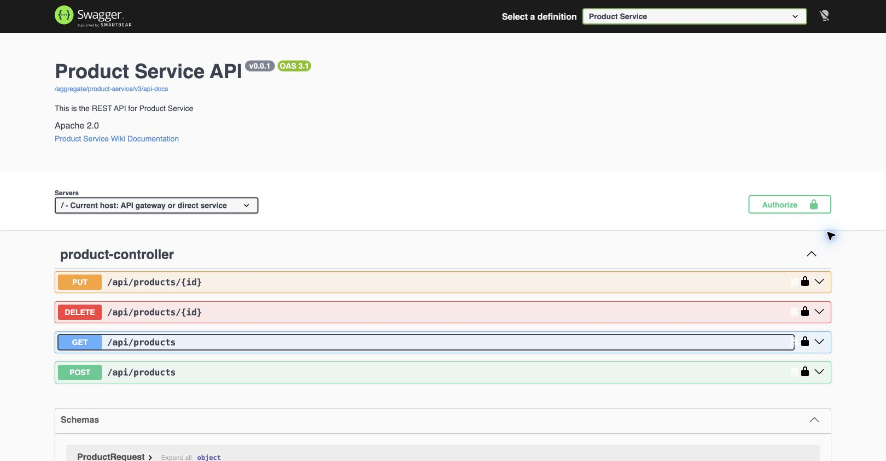
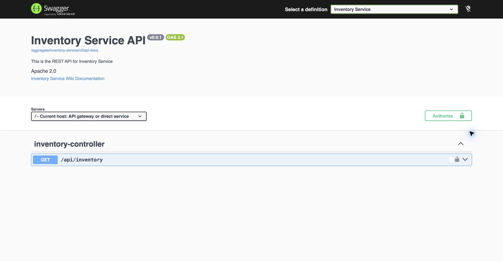
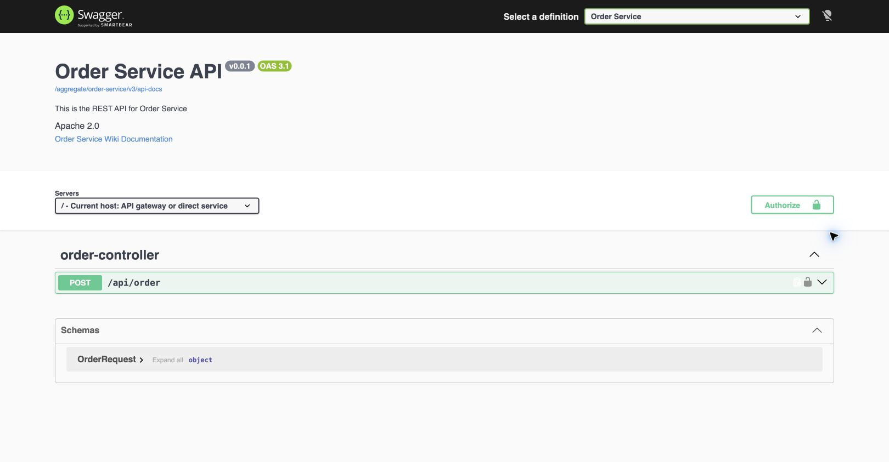
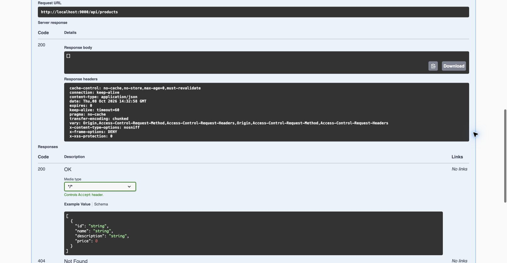

# Part 5 — Kết quả hoàn thành Slot 9

**Nguyen Quang Minh — DE190270 — SE19B04**
Ngày kiểm tra: **08/10/2026**. Source Part 1–4: bản sao từ Slot 7.

## Kiểm thử Maven thực tế

Đã chạy `clean verify` với JDK 21 trên cả bốn module, bao gồm các bài test cũ
và Swagger tests mới. Database thật qua Testcontainers; WireMock giả lập
Inventory khi test Order và giả lập backend khi test Gateway.

| Module | Tests | Failures | Errors | Skipped | Build |
|---|---:|---:|---:|---:|---|
| product-service | 18 | 0 | 0 | 0 | SUCCESS |
| inventory-service | 8 | 0 | 0 | 0 | SUCCESS |
| order-service | 7 | 0 | 0 | 0 | SUCCESS |
| api-gateway | 11 | 0 | 0 | 0 | SUCCESS |
| **Tổng** | **44** | **0** | **0** | **0** | **SUCCESS** |

Trong đó có 17 test Swagger mới và 27 test hồi quy Part 1–4.
[Số liệu trích từ Surefire XML](evidence/maven-summary.json).
Chạy lại từ thư mục ShoppingServices: `sh scripts/verify.sh`.

## Postman collection chạy trên hệ thống thật

Đã chạy collection bằng Newman trên bốn ứng dụng, MongoDB, MySQL, Keycloak
đang chạy thật: **23 requests, 53 assertions, 0 failed**.
[Output lần chạy](evidence/newman-results.txt).
Đây là kết quả chạy collection Postman bằng CLI, không phải ảnh Postman Desktop.

Các nhánh đã kiểm tra: token Keycloak; UI và JSON docs của ba service;
aggregate docs đúng title/version/path; dropdown đủ ba service; anonymous và
invalid JWT trả 401; CORS preflight PUT; tạo/đọc/sửa/xóa Product; kiểm tra tồn
kho; Order qua Gateway gọi Inventory bằng Feign và trả 201.

Collection xóa sản phẩm demo do nó tạo và để lại một order test trong database
Slot 9. Environment trong Git để trống token và product ID.

Spec thực tế lấy qua Gateway:
[Product](evidence/product-openapi.json),
[Inventory](evidence/inventory-openapi.json),
[Order](evidence/order-openapi.json),
[Swagger config Gateway](evidence/gateway-swagger-config.json).

## Kiểm tra giao diện Swagger thật

Đã mở Chrome tại http://localhost:9000/swagger-ui.html, chọn lần lượt ba
service, xác nhận tên API, version, endpoint và schema tải được.
Đã Authorize bằng JWT demo Keycloak rồi thực thi `GET /api/products`:
**Request URL là Gateway port 9000, Server response HTTP 200, body `[]`**.
Body rỗng vì sản phẩm demo đã được collection dọn sau kiểm thử.

Các ảnh dưới đây được chụp từ Swagger UI đang chạy thực tế. Ảnh HTTP 200
chỉ lấy vùng kết quả, không chứa token. Các link Wiki dummy là placeholder
trong hướng dẫn của môn học.

### Product Service

### Inventory Service

### Order Service

### Try it out qua Gateway với JWT

## Commit riêng cho từng TODO

Mỗi TODO DOC-1–DOC-16 có một commit riêng. Header dùng
`type(scope): subject`, động từ chủ động, chữ thường ở đầu, không dấu chấm cuối,
không quá 50 ký tự. Body của các commit TODO ghi rõ mã DOC tương ứng.

| TODO | File | Commit | Commit message |
|---|---|---|---|
| DOC-1 | `product-service/pom.xml` | `ce6afa0` | `build(product): add springdoc dependencies` |
| DOC-2 | `product-service/src/main/resources/application.properties` | `d786f65` | `feat(product): expose Swagger endpoints` |
| DOC-3 | `product-service/.../config/OpenAPIConfig.java` | `ab87aa1` | `feat(product): define OpenAPI metadata` |
| DOC-4 | `product-service/.../config/CorsConfig.java` | `30ab878` | `feat(product): enable Swagger API CORS` |
| DOC-5 | `inventory-service/pom.xml` | `1d3f332` | `build(inventory): add springdoc dependencies` |
| DOC-6 | `inventory-service/src/main/resources/application.properties` | `a3383df` | `feat(inventory): expose Swagger endpoints` |
| DOC-7 | `inventory-service/.../config/OpenAPIConfig.java` | `5330d1c` | `feat(inventory): define OpenAPI metadata` |
| DOC-8 | `inventory-service/.../config/CorsConfig.java` | `6ed17c6` | `feat(inventory): enable Swagger API CORS` |
| DOC-9 | `order-service/pom.xml` | `8dcdf35` | `build(order): add springdoc dependencies` |
| DOC-10 | `order-service/src/main/resources/application.properties` | `dd5f151` | `feat(order): expose Swagger endpoints` |
| DOC-11 | `order-service/.../config/OpenAPIConfig.java` | `6bf8493` | `feat(order): define OpenAPI metadata` |
| DOC-12 | `order-service/.../config/CorsConfig.java` | `5e7dd5f` | `feat(order): enable Swagger API CORS` |
| DOC-13 | `api-gateway/pom.xml` | `b94b505` | `build(api): add springdoc dependencies` |
| DOC-14 | `api-gateway/src/main/resources/application.properties` | `6bb2ac7` | `feat(gateway): configure Swagger service list` |
| DOC-15 | `api-gateway/.../routes/Routes.java` | `ccc6a21` | `feat(gateway): route aggregated OpenAPI docs` |
| DOC-16 | `api-gateway/.../config/SecurityConfig.java` | `d833268` | `feat(gateway): allow public Swagger access` |

Các commit bổ sung cho sao chép source, Java 21, tests, Authorize JWT,
profile test và môi trường local được liệt kê ở [COMMITS.md](COMMITS.md).

## Tự chụp lại để đưa vào báo cáo

1. Chạy `python3 scripts/local.py start` tại ShoppingServices nếu hệ thống đang dừng.
2. Chụp Swagger UI cho ba definition như các ảnh trên. Với mỗi nhóm TODO,
   có thể bổ sung ảnh file tương ứng trong IDE và `git show <hash>` ở bảng commit.
3. Import hai file trong `postman/`, chọn environment **MSS301 Slot 9 Local**.
   Chạy collection theo thứ tự, chụp màn hình Runner có **23 requests**,
   **53 assertions**, không thất bại; mở các request docs để chụp JSON title/version.
4. Chạy request token, nhập `access_token` vào Swagger Authorize, gọi
   `GET /api/products`, chụp Request URL + Server response 200. Tránh chụp phần cURL
   có token. Đổi definition có thể cần Authorize lại.
5. Trong Postman mở các request anonymous để chụp HTTP 401 và các request JWT
   để chụp kết quả CRUD/Inventory/Order 201.
6. Chạy `sh scripts/verify.sh`, chụp tổng kết `Tests run` và `BUILD SUCCESS`
   của cả bốn module. Dùng [maven-summary.json](evidence/maven-summary.json)
   để đối chiếu 44 test.

Các phiên bản và điều chỉnh so với snippet được giải thích trong
[README](../README.md#khác-biệt-cần-thiết-so-với-snippet-trong-đề).
